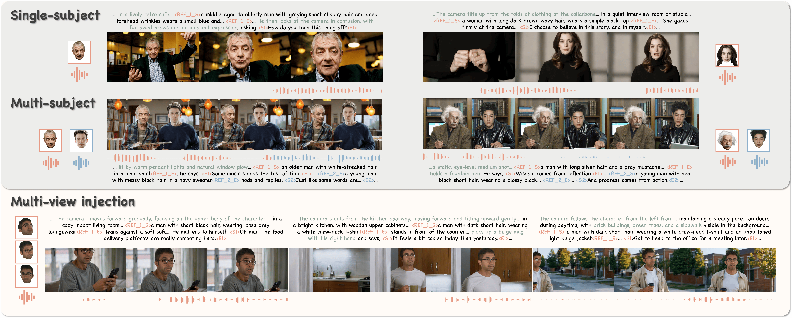

# Identity-as-Presence
Official implementation of "Identity as Presence: Towards Appearance and Voice Personalized Joint Audio-Video Generation"

**Identity as Presence: Towards Appearance and Voice Personalized Joint Audio-Video Generation**<br>
[Yingjie Chen](https://chen-yingjie.github.io/), 
Shilun Lin,
Cai Xing,
Qixin Yan,
Wenjing Wang,
Dingming Liu,
Hao Liu,
Chen Li,
Jing LYU<br>

<p align="center">
<a href="https://arxiv.org/abs/TBD">"></a>
<a href="https://chen-yingjie.github.io/projects/Identity-as-Presence/index.html"></a>
<a href=""></a>
<a href="" target='_blank'>

</a>
</p>

<p align="center">

</p>

## 💡 Abstract
Recent advances have demonstrated compelling capabilities in synthesizing real individuals into generated videos, reflecting the growing demand for identity-aware content creation. Nevertheless, an openly accessible framework enabling fine-grained control over facial appearance and voice timbre across multiple identities remains unavailable. In this work, we present a unified and scalable framework for identity-aware joint audio-video generation, enabling high-fidelity and consistent personalization. Specifically, we introduce a data curation pipeline that automatically extracts identity-bearing information with paired annotations across audio and visual modalities, covering diverse scenarios from single-subject to multi-subject interactions. We further propose a flexible and scalable identity injection mechanism for single- and multi-subject scenarios, in which both facial appearance and vocal timbre act as identity-bearing control signals. Moreover, in light of modality disparity, we design a multi-stage training strategy to accelerate convergence and enforce cross-modal coherence. Experiments demonstrate the superiority of the proposed framework.

## 🔥 Updates
- (2026-03-18) The project page, demo video and technical report are released.

## 📑 TODO List
  - [x] Release inference code and model weights for single-subject scenarios
  - [ ] Release inference code and model weights for multi-subject scenarios

## Usage
### Environment
```shell
$ pip install -r requirements.txt
```

### Pretrained Weights

Please download the following pretrained models and place them in the `ckpts` directory:

1. **MMAudio**: https://huggingface.co/hkchengrex/MMAudio
2. **Wan2.2-TI2V-5B**: https://huggingface.co/Wan-AI/Wan2.2-TI2V-5B
3. **Identity-as-Presence**: https://huggingface.co/echoanran/Identity-as-Presence

After downloading, ensure all model files are placed in the `ckpts` directory and properly configured.

### Inference
```shell
$ bash infer.sh
```
The results will be saved in `results` directory.

## 🎥 Demo 

### Single-subject Personalized Generation
<table class="center">
<tr>
    <td width="25%">
      <video controls src="https://github.com/user-attachments/assets/f8d33217-9fa7-4fdb-8304-a4c03ad140a9" width="100%"></video>
    </td>
    <td width="25%">
      <video controls src="https://github.com/user-attachments/assets/d18d563d-19cd-4479-8dea-a2fb7c8295c3" width="100%"></video>
    </td>
    <td width="25%">
      <video controls src="https://github.com/user-attachments/assets/f6467eaf-d021-4f61-93b5-7f0a6198e91a" width="100%"></video>
    </td>
    <td width="25%">
      <video controls src="https://github.com/user-attachments/assets/3aa8f622-70ec-41ae-be83-bd35050ba0a0" width="100%"></video>
    </td>
</tr>
<tr>
    <td width=25% style="border: none">
      <video controls autoplay loop src="https://github.com/user-attachments/assets/ba26a1dd-b8be-477c-b97d-cffb41c088ce" muted="false"></video>
    </td>
    <td width=25% style="border: none">
      <video controls autoplay loop src="https://github.com/user-attachments/assets/c26a9e54-8267-402c-b09a-c2229622a650" muted="false"></video>
    </td>
    <td width=25% style="border: none">
      <video controls autoplay loop src="https://github.com/user-attachments/assets/66f6113b-3fb2-4b29-951d-ba0bfbfa259c" muted="false"></video>
    </td>
    <td width=25% style="border: none">
      <video controls autoplay loop src="https://github.com/user-attachments/assets/8ac02afd-01ae-414e-94f2-2559af025d14" muted="false"></video>
    </td>
</tr>
</table>

### Multi-subject Personalized Generation
<table class="center">
<tr>
    <td width="25%" valign="top">
      
      <video controls src="https://github.com/user-attachments/assets/67bfe53c-f2f4-486d-9e46-4e7d1ed58e08" width="45%" valign="middle"></video>
      
      <video controls src="https://github.com/user-attachments/assets/d425bbab-214b-439f-96c0-c157efbe27d4" width="45%" valign="middle"></video>
      <video controls autoplay loop muted src="https://github.com/user-attachments/assets/f58bcb3b-5058-44a5-ad9f-bd4f8b50c89b" width="100%"></video>
    </td>
    <td width="25%" valign="top">
      
      <video controls src="https://github.com/user-attachments/assets/9c63075b-5e23-4458-97a1-a776e86a30f2" width="45%" valign="middle"></video>
      
      <video controls src="https://github.com/user-attachments/assets/3c92c142-da54-4824-b196-20860938456a" width="45%" valign="middle"></video>
      <video controls autoplay loop muted src="https://github.com/user-attachments/assets/29728cb6-aaeb-45be-a560-16d8238c3d9e" width="100%"></video>
    </td>
    <td width="25%" valign="top">
      
      <video controls src="https://github.com/user-attachments/assets/8954d491-a141-4b63-b1c2-4dbbdda30bb0" width="45%" valign="middle"></video>
      
      <video controls src="https://github.com/user-attachments/assets/e0b28db2-6c40-408f-946f-d8eedc13be79" width="45%" valign="middle"></video>
      <video controls autoplay loop muted src="https://github.com/user-attachments/assets/7e24c06d-8929-427f-bd58-e38b0ebec16b" width="100%"></video>
    </td>
    <td width="25%" valign="top">
      
      <video controls src="https://github.com/user-attachments/assets/09a1ff89-f2bd-4072-855d-dad42b23815c" width="45%" valign="middle"></video>
      
      <video controls src="https://github.com/user-attachments/assets/512a19ad-d56c-4ebe-9c2e-c4fdaa742e5b" width="45%" valign="middle"></video>
      <video controls autoplay loop muted src="https://github.com/user-attachments/assets/8191d7cd-89fa-4378-9b83-b9e8f964bf67" width="100%"></video>
    </td>
</tr>
</table>


For more details, please refer to our [project page](https://chen-yingjie.github.io/projects/Identity-as-Presence/index.html).

## 🔗 Citation

If you find this code useful for your research, please use the following BibTeX entry.

```bibtex
@inproceedings{chen2026identity,
  title={Identity as Presence: Towards Appearance and Voice Personalized Joint Audio-Video Generation},
  author={Chen, Yingjie and Lin, Shilun and Xing, Cai and Yan, Qixin and Wang, Wenjing and Liu, Dingming and Liu, Hao and Li, Chen and LYU, Jing},
  journal={arXiv preprint arXiv:TBD},
  website={https://chen-yingjie.github.io/projects/Identity-as-Presence/index.html},
  year={2026}}
```

## Acknowledgements

We would like to thank the contributors to various open-source projects for their research and exploration.